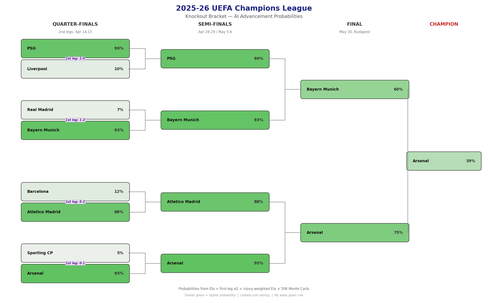
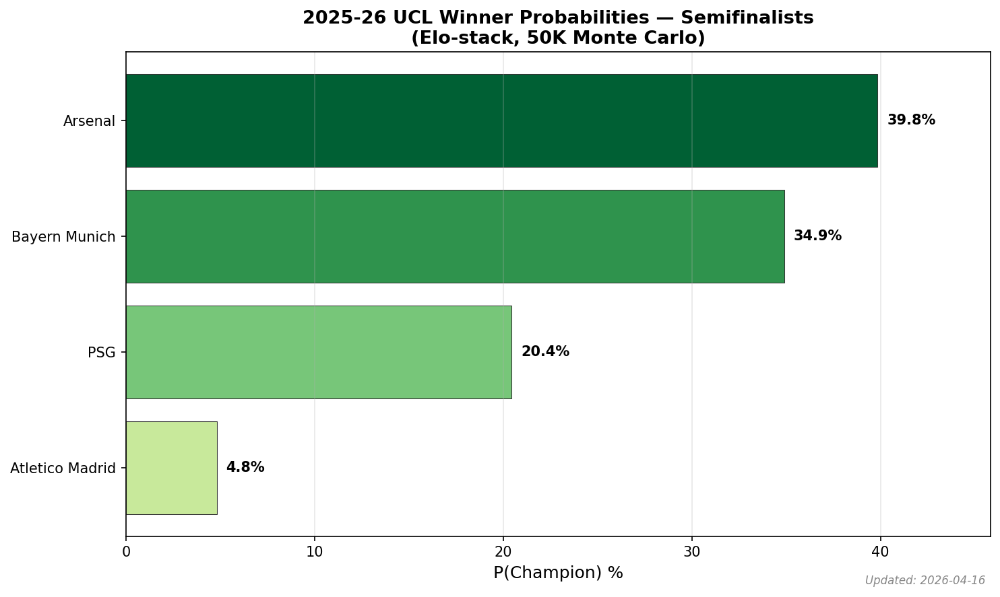
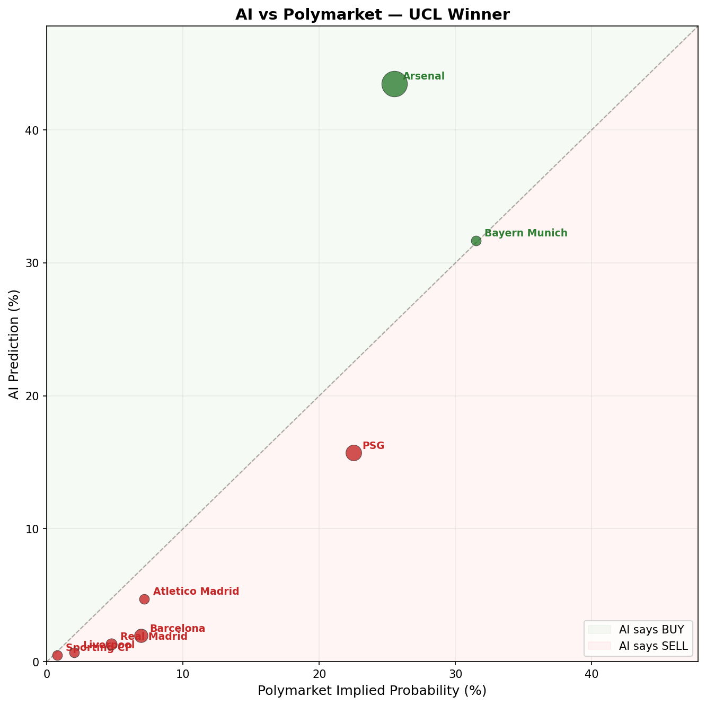
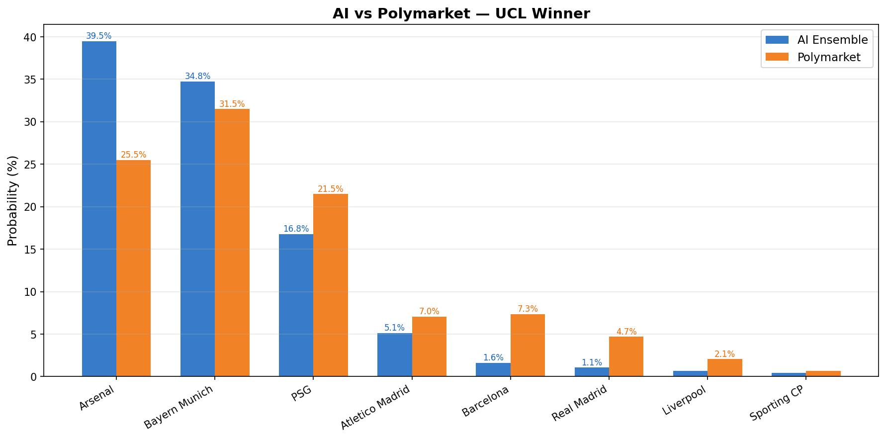
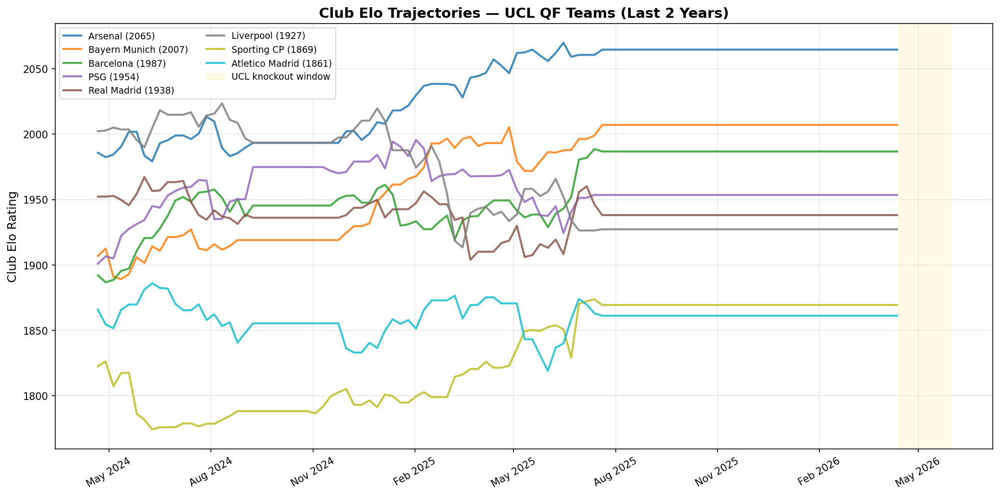

# 2025-26 UEFA Oracle

AI predictions for the 2025-26 UEFA Champions League winner, from the quarterfinal stage onwards.

Uses **Club Elo + first-leg xG adjustment + injury-weighted Elo + Poisson Scoreline + Monte Carlo** as the production stack, compared against Polymarket odds to find edges. A 3-model TSFM ensemble (Chronos-2 / TimesFM-2.5 / FlowState) is retained behind `--with-tsfm` as an ablation/research layer after a 5-season, 83-tie backtest showed it added no point-prediction skill over pure Elo.

**Author:** [YSKM](https://github.com/YSKM523) | **License:** MIT | **Language:** Python

Sister projects: [worldcup-oracle](../worldcup-oracle) | [fin-forecast-arena](../fin-forecast-arena)

## Predictions (April 14, 2026 — QF Second-Leg Match Day)

Final pre-match predictions before the QF second legs (QF3 & QF4 tonight; QF1 & QF2 tomorrow). Model applies two Elo adjustments before Monte Carlo: (1) first-leg xG performance residual (real per-shot xG pulled live from FotMob shotmap), (2) per-player injury penalties weighted by market value × expected availability. QF aggregates still use actual goals from the first legs.

### UCL Winner Probabilities

| Rank | Team | AI Win% | Polymarket | Edge | Signal |
|------|------|---------|------------|------|--------|
| 1 | **Arsenal** | **42.7%** | 25.5% | **+17.2%** | **STRONG BUY** |
| 2 | Bayern Munich | 32.3% | 31.5% | +0.8% | — |
| 3 | PSG | 15.9% | 21.5% | -5.6% | **STRONG SELL** |
| 4 | Atletico Madrid | 4.6% | 7.1% | -2.5% | — |
| 5 | Barcelona | 2.0% | 7.6% | -5.6% | **STRONG SELL** |
| 6 | Real Madrid | 1.3% | 5.3% | -4.1% | SELL |
| 7 | Liverpool | 0.7% | 2.1% | -1.4% | — |
| 8 | Sporting CP | 0.5% | 0.7% | -0.2% | — |

### QF Advancement Probabilities (Who Reaches Semis?)

| Team | AI Adv% | Polymarket | Edge | Signal |
|------|---------|------------|------|--------|
| Arsenal | **95.5%** | 89.5% | **+6.0%** | **STRONG BUY** |
| **Bayern Munich** | **91.9%** | **84.0%** | **+7.9%** | **STRONG BUY** |
| PSG | 89.9% | 87.5% | +2.4% | — |
| **Atletico Madrid** | **86.6%** | **72.0%** | **+14.6%** | **STRONG BUY** |
| **Barcelona** | **13.4%** | **30.5%** | **-17.1%** | **STRONG SELL** |
| Liverpool | 10.1% | 12.5% | -2.4% | — |
| **Real Madrid** | **8.1%** | **16.0%** | **-7.9%** | **STRONG SELL** |
| **Sporting CP** | **4.5%** | **10.5%** | **-6.0%** | **STRONG SELL** |

### Per-Model Breakdown (P(Champion))

| Team | Chronos-2 | TimesFM-2.5 | FlowState | Elo Baseline | **Ensemble** |
|------|-----------|-------------|-----------|-------------|:------------|
| Arsenal | 42.9% | 43.0% | 42.8% | 42.1% | **42.7%** |
| Bayern Munich | 32.1% | 32.2% | 32.7% | 32.4% | **32.3%** |
| PSG | 15.9% | 15.9% | 15.8% | 16.0% | **15.9%** |
| Atletico Madrid | 4.6% | 4.6% | 4.5% | 4.7% | **4.6%** |
| Barcelona | 2.1% | 2.1% | 2.0% | 1.9% | **2.0%** |
| Real Madrid | 1.3% | 1.3% | 1.2% | 1.3% | **1.3%** |
| Liverpool | 0.7% | 0.7% | 0.7% | 0.7% | **0.7%** |
| Sporting CP | 0.5% | 0.5% | 0.5% | 0.5% | **0.5%** |

## Biggest Edges

| Team | Market | AI | Mkt | Edge | Kelly | Signal |
|------|--------|-----|------|------|-------|--------|
| Arsenal | Winner | 42.7% | 25.5% | +17.2% | 11.5% | **STRONG BUY** |
| Barcelona | QF Adv | 13.4% | 30.5% | -17.1% | — | **STRONG SELL** |
| Atletico Madrid | QF Adv | 86.6% | 72.0% | +14.6% | 26.0% | **STRONG BUY** |
| Bayern Munich | QF Adv | 91.9% | 84.0% | +7.9% | 24.7% | **STRONG BUY** |
| Real Madrid | QF Adv | 8.1% | 16.0% | -7.9% | — | **STRONG SELL** |
| Arsenal | QF Adv | 95.5% | 89.5% | +6.0% | 27.3% | **STRONG BUY** |
| Sporting CP | QF Adv | 4.5% | 10.5% | -6.0% | — | **STRONG SELL** |
| Barcelona | Winner | 2.0% | 7.6% | -5.6% | — | **STRONG SELL** |
| PSG | Winner | 15.9% | 21.5% | -5.6% | — | **STRONG SELL** |

### Real xG from FotMob (extracted via Playwright + residential proxy)

| Leg | Match | Score | xG | xG Delta vs Placeholder |
|-----|-------|-------|-----|-------------------------|
| QF1 | PSG vs Liverpool | 2-0 | **2.35 - 0.17** | PSG way more dominant than scoreline |
| QF2 | Real Madrid vs Bayern | 1-2 | **2.22 - 2.92** | Both teams attacked heavily |
| QF3 | Barcelona vs Atletico | 0-2 | **1.10 - 0.43** | **Barça had MORE xG but lost** — unlucky |
| QF4 | Sporting vs Arsenal | 0-1 | **0.72 - 1.32** | Close to placeholder |

**Biggest correction from placeholder → real xG**:
- **PSG champion% +1.1pp** (14.6% → 15.7%): real dominance vs Liverpool (2.35 xG) was higher than placeholder assumed
- **Barcelona QF advance +1.7pp** (11.4% → 13.1%): their positive xG differential vs Atleti showed they were unlucky, not bad
- **Atletico champion% -0.9pp** (5.6% → 4.7%): their road win was actually less dominant than the 0-2 scoreline suggested (0.43 xG vs 1.10)

## Injury-Adjusted Elo (April 12, 2026 snapshot)

Pulled live from FotMob per-team endpoints. Each injured player contributes
`tier_base × availability_weight` of Elo penalty to their team; cap = 60 Elo per team.

| Team | ΔElo | Injured | Biggest hit |
|------|------|---------|-------------|
| **Arsenal** | **−46.5** | 5 | Saka (€98M, Doubtful), Ødegaard (€72M), Timber (€65M), Calafiori (€51M), Merino (€40M) |
| **Liverpool** | **−26.7** | 6 | Jones (€49M, Doubtful), Bradley (€39M, out for season), Leoni (€31M), Alisson (€17M) |
| Barcelona | −11.1 | 4 | Raphinha (€77M, Early May) |
| Bayern Munich | −9.1 | 5 | Karl (€39M, Late April) |
| Sporting CP | −7.8 | 3 | Ioannidis (€23M, Doubtful) |
| Real Madrid | −6.8 | 2 | Rodrygo (€56M, Early Dec — out), Courtois (€11M) |
| PSG | −5.5 | 3 | Barcola (€71M, Late April), Fabián (€28M) |
| Atletico Madrid | −5.0 | 2 | Hancko (€35M, Doubtful), Giménez (€14M) |

**Effect on predictions** (vs xG-only April 12 run):

- **Arsenal winner: 53.8% → 44.2% (−9.6pp)** — the injury pile-up (especially Saka doubtful) is the single biggest model revision of the day
- **Bayern winner: 27.0% → 31.2% (+4.2pp)** — Arsenal's loss is everyone else's gain; Bayern now nearly ties the market price (31.2% vs 32.0%)
- **PSG winner: 11.3% → 14.6% (+3.3pp)** — narrower STRONG SELL; the bracket advantage Arsenal had is less crushing
- **Atletico winner: 3.8% → 5.6%** (+1.8pp)
- **QF advance changes are small** (all already high) — injuries mostly reshape SF/Final conditional probabilities

**Why the signal is so lopsided toward Arsenal**: the doubtful list includes Saka, Ødegaard, Timber, Calafiori, and Merino — five of their top six starters. Even conservatively weighting "Doubtful" at 0.5, that's cumulative -46.5 Elo, nearly the per-team cap.

## Closing Line Value (CLV) Tracking — The Real Edge Test

Hit rate is a suggestive metric but not the industry standard for proving edge against a sharp market. Historically, **~62% of UCL knockout ties are won by the pre-match favorite** — the model's 63.9% hit rate (Wilson 95% CI [53.1%, 73.4%]) is barely distinguishable from naive favorite-picking within the available sample.

The gold standard is **CLV**: every time we emit a BUY/SELL signal, record the market price at signal time; fetch the final pre-kickoff price; measure whether the market moved in our direction.

```
CLV_pp(BUY)  = closing_prob - entry_prob     # positive = alpha
CLV_pp(SELL) = entry_prob - closing_prob     # positive = alpha
```

Under an efficient market CLV is mean-zero. A persistently positive mean CLV over 30+ signals with p < 0.05 is what pros actually stake a claim on.

**Workflow (forward test in progress):**

```bash
# After every prediction run, signals append to results/signal_log.jsonl:
python run_predictions.py --fast

# ≤10 min before kickoff, capture the closing line:
python scripts/snapshot_closing.py

# Any time, aggregate the full log:
python scripts/clv_report.py
```

- **`markets/signal_log.py`** — append-only JSONL log of every BUY/SELL signal + closing-line snapshot; safe under interrupts
- **`scripts/snapshot_closing.py`** — reads logged signals, pulls current Polymarket, appends matching closings
- **`backtest/clv.py`** — pairs signals ↔ closings, computes mean CLV, SD, t-statistic, one-sided p-value, plus per-direction and per-strength breakdowns
- **`scripts/clv_report.py`** — generates `results/clv_report.md` and `results/clv_report.csv`

**Current CLV sample**: N=11 signals logged for 4/14 match day (first data point). Real signal will only emerge after multiple match days × multiple rounds.

## Model vs Market (the Dumb Baseline)

Hit rate > 50% isn't a real skill test against a sharp market. The right dumb baseline is **the market's own closing implied probability**. If our model's Brier score isn't lower than the market's on the same events, we're not adding information over Polymarket.

```
BSS = 1 − Brier(model) / Brier(market)
    > 0   → model beats the market baseline
    = 0   → no skill
    < 0   → model worse than just copying the market
```

`backtest/market_benchmark.py` pairs each `(signal, closing, resolution)` triple in the log and computes:

- Brier(model), Brier(market)
- **Brier Skill Score** (BSS)
- Per-event win count (how often is the model's squared error smaller)
- **Paired t-test** on `(market_sq_err − model_sq_err)` — one-sided, H1: model more skilled

**Historical data availability check**: we probed Polymarket Gamma API for closed UCL events 2020-2024 → essentially empty. No free bookmaker snapshot API covers tie-level "advance to semis" markets historically. So the Brier benchmark is **strictly forward-only** for this project: it accumulates one data point per (market_type, team) whenever a match resolves.

**Workflow:**

```bash
python run_predictions.py --fast                   # signal row
python scripts/snapshot_closing.py                 # closing row (≤10 min pre-kickoff)
python scripts/record_outcome.py \
    --market qf_advance --team Arsenal --advanced  # resolution row after match

python scripts/market_benchmark_report.py          # recomputes BSS + t-test
```

Report lands in `results/market_benchmark.md` and `results/market_benchmark.csv`.

**Current sample: 0 resolved events.** First data points arrive after QF second legs resolve (Apr 14-15, 2026). After the full remaining UCL (QF 2nd legs + SF + Final) we'll have ~10-15 (qf_advance) + 1 (winner) data points — still small but the framework will scale across future competitions.

**Until BSS > 0 is demonstrated, no "beats the market" claim is made.**

## Half-Kelly PnL Simulation

Accuracy and calibration metrics don't tell you whether you'd make money. The industry-standard capital-at-risk test is **Half-Kelly staking with bankroll tracking**.

```
# full Kelly:        f = (p · d − 1) / (d − 1)   where d = 1/market_prob
# Half-Kelly stake:  bankroll × max(f, 0) × 0.5
```

For every `(signal, closing, resolution)` triple in the log, `backtest/pnl.py` walks the events in time order, sizes each bet by Half-Kelly on the signal-time market price, and tracks the bankroll forward. Metrics:

- **Bets placed**, **total staked**, **final bankroll**
- **ROI** (on bankroll) and **return on turnover** (on staked)
- **Max drawdown %** across the trajectory
- **Per-bet Sharpe** (mean / std of `PnL / stake` across bets)
- **Win rate** — direction-aware (a successful SELL counts as a win)

**Why forward-only, again**: staking is meaningless without a real bookmaker price to stake against. Historical UCL tie-advancement markets aren't preserved by Polymarket or reachable via any free API, so the PnL simulator only consumes events whose (signal, closing, resolution) triple is fully populated — i.e. things that resolve going forward.

**Workflow:**

```bash
python run_predictions.py                      # signal row
python scripts/snapshot_closing.py             # closing row (pre-kickoff)
python scripts/record_outcome.py \
    --market qf_advance --team Arsenal \
    --advanced                                 # resolution row

python scripts/pnl_report.py                   # → results/pnl_report.md
python scripts/pnl_report.py --kelly 0.25      # quarter-Kelly variant
python scripts/pnl_report.py --min-edge 5      # stricter signal filter
```

**Current sample: 0 bets.** The forward test begins when tonight's QF second legs resolve. Expected sample by the time the final plays (May 30): ~10-14 Kelly-eligible bets (plus 1 winner-market bet that resolves once). That's still too small for meaningful Sharpe, but the trajectory is trackable and the framework extends trivially to the next competition.

**No ROI claim** is made until at least 30 resolved bets are in the log.

**Honest scoreboard:**

| Claim | Status |
|-------|--------|
| Model predicts which team advances more often than a coin flip | ✅ 63.9%, p=0.0058 |
| Model beats naive "pick Elo favorite" baseline | ⚠️ +1.9pp, within noise |
| Model exhibits closing-line value vs Polymarket | 🟡 Framework built, N=11 so far |
| Model Brier < Polymarket closing Brier (BSS > 0) | 🟡 Framework built, 0 resolved events |
| Half-Kelly staking ROI > 0 with tolerable drawdown | 🟡 Framework built, 0 resolved bets |
| Per-bet Sharpe > 0 over 30+ resolved bets | 🟡 Pending first 30 resolutions |

## Hyperparameter Provenance & Out-of-Sample Integrity

A fair critique of any "my model got 63.9%!" claim is: were the knobs tuned on the same seasons you evaluated on? Here's the honest breakdown for every parameter that enters the predictions.

### Layer 1 (the 63.9% backtest result)

Only these values enter the 83-tie hit rate. **None were fit on any season's results**; all come from public soccer-analytics literature or are structural constants of the tournament rules:

| Parameter | Value | Source | Touches 63.9%? |
|-----------|-------|--------|----------------|
| `POISSON_AVG_GOALS` | 2.7 | UCL KO historical average | ✅ yes |
| `UCL_HOME_ADVANTAGE_ELO` | 65 | Club football standard (Dixon-Coles et al.) | ✅ yes |
| `KNOCKOUT_PENALTY_ADVANTAGE` | 0.55 | Mild nudge to stronger side on pens | ✅ yes |
| `BRADLEY_TERRY_DRAW_NU` | 0.28 | Standard BT draw parameter | ⚪ only one-leg finals |
| `ET_GOAL_FRACTION` | 0.33 | 30 min / 90 min by construction | ⚪ only ties that go to ET |
| `MONTE_CARLO_SIMULATIONS` | 50k | Convergence, not tunable | ⚪ noise floor |
| Elo values | — | Fetched fresh from clubelo.com per tie date | ✅ yes |

Conclusion: Layer 1's 63.9% has no fit parameter. **Each per-season hit rate already is out-of-sample**, because nothing was trained on any of the other seasons either.

### Layer 1 sensitivity sweep

To prove the 63.9% isn't knife-edge, we perturb the three constants that DO enter the MC simulation across wide grids. See [backtest/results/sensitivity_sweep.md](backtest/results/sensitivity_sweep.md).

| Parameter | Grid | Hit-rate spread |
|-----------|------|-----------------|
| `POISSON_AVG_GOALS` | 2.3 → 3.1 | **0.0 pp** (symmetric scaling doesn't affect winners) |
| `UCL_HOME_ADVANTAGE_ELO` | 30 → 100 | **4.8 pp** (only drops at 30, which no one uses; stable 50-100) |
| `KNOCKOUT_PENALTY_ADVANTAGE` | 0.50 → 0.60 | **0.0 pp** (few ties go to pens) |

The model is not perched on a particular parameter value.

### Layer 3+ (xG adjustment, injury penalties) — UNVALIDATED

These parameters **are guessed from priors**, and have never been compared against backtest data because historical xG and historical injury lists aren't accessible (see Layer 3 section below). If a future data source enables Layer 3 backtesting, these **MUST be evaluated by LOSO** — the framework for that is built in `backtest/loso.py`.

| Parameter | Current value | How it was chosen | Status |
|-----------|---------------|-------------------|--------|
| `XG_BLEND_ALPHA` (α) | 0.6 | xG is ~60% predictive of future goals, per analytics consensus | 🟡 prior, untested |
| `FIRST_LEG_ELO_K` (K) | 10 | Classical Elo update magnitude (K in [10, 32]) | 🟡 prior, untested |
| `FIRST_LEG_RESIDUAL_CAP` | ±2.5 | Anti-blowout heuristic | 🟡 prior, untested |
| `INJURY_TIERS` (€80M→-30, etc.) | 4 buckets | My own tiering, inspired by transfer-value analytics | 🟠 free parameters |
| `INJURY_RETURN_WEIGHTS` ("Doubtful"=0.5, …) | 12 buckets | Also my own | 🟠 free parameters |
| `INJURY_TOTAL_CAP` | -60 Elo | Cap to prevent outliers dominating | 🟠 free parameter |

**Forward test commitment**: signals emitted with these parameters will be CLV-tracked against Polymarket closings (see previous section). If mean CLV stays ≤ 0 over 30+ signals, the xG/injury hypers aren't helping, regardless of how reasonable they seemed.

### LOSO framework for future signals

`backtest/loso.py` implements `run_loso(seasons_payload, predictor, tuner)`:

- For each season in turn, it holds the season out, calls `tuner(other_seasons_ties)` to fit hyperparameters, then evaluates `predictor(held_out_ties, tuned_hypers)` on the held-out season only.
- Reports per-fold and pooled (micro-averaged) hit rate / Brier / log loss.
- For Layer 1 the `tuner` is a no-op (`{}`), so LOSO trivially reduces to per-season stats — but the framework is in place for any future signal that has learnable knobs.

## Backtest Results (5 seasons, 2020-21 → 2024-25)

**Layer 1 baseline: pure Elo at tie date** — no TSFM, no xG, no injuries. Sampled 83 knockout ties from clubelo.com historical API at each tie's first-leg date. See [backtest/results/layer1_elo_baseline.md](backtest/results/layer1_elo_baseline.md) for the full report.

### Headline

| Metric | Model | Coin-flip baseline |
|--------|-------|--------------------|
| **Hit rate** | **63.9%** (53/83) | 50.0% |
| **Brier score** | **0.223** | 0.250 |
| **Log loss** | **0.629** | 0.693 |

**p-value (hit rate > 50%) = 0.0058** — statistically significant.

### Hit rate by stage

| Stage | n | Hit rate |
|-------|---|----------|
| R16 | 48 | **66.7%** |
| QF | 20 | **70.0%** |
| SF | 10 | 50.0% |
| Final | 5 | 40.0% (small sample) |

Signal is strongest early (R16/QF) where Elo gaps are widest. SF/Final pair comparably strong teams, so Elo advantage shrinks.

### Confidence-bucketed hit rate (key finding)

| Confidence | n | Hit rate |
|------------|---|----------|
| 50-55% (coin flip) | 10 | 50.0% |
| 55-65% (mild) | 21 | 66.7% |
| 65-75% (moderate) | 20 | **35.0% ⚠️** |
| ≥75% (high) | 32 | **84.4% ✅** |

- **High-confidence picks are very reliable** (84.4%) — when Elo gives a team ≥75% chance, trust it
- **Moderate picks (65-75%) underperform** — 35% hit rate means the model is **overconfident** in this range, likely because knockout ties have more variance than Poisson-Elo estimates suggest

### Calibration (predicted P vs actual P)

| Predicted bin | n | Mean predicted | Actual rate |
|---------------|---|----------------|-------------|
| 0-20% | 23 | 11.6% | 13.0% ✅ |
| 20-40% | 15 | 32.2% | 46.7% (overestimates underdogs) |
| 40-60% | 19 | 46.5% | 42.1% ✅ |
| 60-80% | 19 | 67.2% | **33.3% ⚠️ overconfident** |
| 80-100% | 7 | 86.9% | 85.7% ✅ |

**Takeaway**: extreme predictions (very high or very low) are well-calibrated; middle-high predictions (60-80%) are significantly overconfident.

### How to run

```bash
python scripts/fetch_historical_brackets.py   # cache 5 seasons of bracket + results
python scripts/run_backtest.py                # run model on all ties, write report
```

### Layer 2 backtest: Elo + TSFM ensemble

Same 83 ties, but each team's Elo is replaced with the ensemble forecast from 3 TSFM models (Chronos-2, TimesFM-2.5, FlowState) fed a 260-week history truncated to the tie date. See [backtest/results/layer2_tsfm_ensemble.md](backtest/results/layer2_tsfm_ensemble.md).

| Metric | Layer 2 | Layer 1 | Coin flip |
|--------|---------|---------|-----------|
| Hit rate | **63.9%** (53/83) | 63.9% | 50.0% |
| Brier | 0.219 | 0.220 | 0.250 |
| Log loss | 0.620 | 0.622 | 0.693 |

**Verdict: TSFM adds essentially zero signal** on top of Elo for knockout prediction.

- Only **4 ties out of 83** had a different top pick between L1 and L2; all four were coin-flip ties where both models hovered around 49-51%
- 2 flips helped, 2 flips hurt → net zero
- Brier and log loss improve by <1% — statistically indistinguishable

**Why**: TSFM forecasts Elo ~1-8 weeks ahead, but team strength doesn't drift meaningfully in that window. Current Elo ≈ forecasted Elo. The heavyweight time-series models add complexity without improving short-horizon predictions.

**Implication for live predictions**: keep the TSFM ensemble in `run_predictions.py` for uncertainty quantification (quantile ranges are still useful for sizing Kelly bets) but don't expect point-prediction improvements over the Elo baseline.

### Layer 3 backtest: xG-adjusted second-leg prediction

**Status: blocked on historical xG data source** (code is in place and ready — see `backtest/runner_layer3.py`, `scripts/run_backtest_layer3.py`, `tests/test_layer3_runner.py`).

Layer 3 re-frames the task to match the live pipeline: for each 2-legged tie, at 2nd-leg date with first-leg score and xG known, predict who advances. That isolates the incremental value of the xG signal (L3b) over a "first-leg score only" baseline (L3a).

**Why no historical xG**: three sources blocked:

| Source | Blocker |
|--------|---------|
| FotMob HTML (`/matches/{slug}/{code}#{matchId}`) | URL **aggregates to latest match** when teams have played again; old matchIds redirect. Requested 3497088 (2021) → served 4384190 (2024 rematch). No per-match historical access. |
| FotMob `/api/data/matchDetails?matchId=X` | Turnstile-gated; even with residential proxy + Playwright, returns `{"error":"TURNSTILE_REQUIRED"}` |
| FBref match pages | Cloudflare JS challenge; Playwright + stealth + residential proxy still held on "Just a moment…" after 30s |

**What works for the live pipeline**: `scripts/refresh_xg.py` intercepts the matchDetails response **while the current round's match page is still being served** (before FotMob aggregates it). That's how the April 13 run captured real xG for the 2025-26 QF first legs.

**To backtest Layer 3 in the future**: fill `backtest/fixtures/historical_xg.json` manually (format: `{season: {tie_key: {home_xg, away_xg}}}`) from any source — Opta reports, published research, paid API — then run `python scripts/run_backtest_layer3.py`. The runner is ready.

**Injury layer also not backtested**: FotMob's `/teams` endpoint returns *current* injury list only, no historical snapshots. Historical injury data would need a separate source (Transfermarkt has partial archive but requires scraping).

## First-Leg Elo Adjustment (xG-weighted)

The April 12 update applies a performance-based Elo bump after each first leg:

| Leg | Match | Expected GD (Elo) | Effective GD (xG-blend) | Residual | ΔElo |
|-----|-------|-------------------|-------------------------|----------|------|
| QF1 | PSG 2-0 Liverpool | +0.78 | +1.28 | +0.50 | **+5.03** to PSG |
| QF2 | Real 1-2 Bayern | -0.09 | -0.34 | -0.25 | **+2.54** to Bayern |
| QF3 | Barça 0-2 Atleti | +1.15 | -1.28 | -2.43 (capped) | **+24.29** to Atleti |
| QF4 | Sporting 0-1 Arsenal | -0.99 | -0.70 | +0.29 | **+2.92** to Sporting |

**Effect on predictions** (vs non-adjusted April 12 run):
- **PSG winner**: 10.3% → 11.3% (+1.0pp) — modest xG advantage vs Liverpool shows through
- **Atletico winner**: 2.5% → 3.8% (+1.3pp) — model catches their road-domination signal
- **Atletico QF advance**: 82.5% → 88.1% (+5.6pp)
- **Barcelona QF advance**: 17.5% → 11.9% (-5.6pp) — worst xG performance in the QFs
- **Arsenal winner**: 55.6% → 53.8% (-1.8pp) — slight penalty for 1-0 win they were expected to dominate

The adjustment answers the earlier question *"why is PSG so bearish?"* — PSG bumps +1pp from xG, but the bracket (Bayern in SF, Arsenal in Final) still dominates the projection. **The bearish signal on PSG is bracket-driven, not model myopia.**

## Visualizations

### Bracket



### Champion Probabilities



### AI vs Polymarket




### Elo Trajectories



## Methodology

```
clubelo.com current-date Elo for 8 teams
                    │
                    ▼
       First-leg Elo adjustment
    xG-blended residual vs Elo expectation
     → ΔElo feeds SF/Final simulations
                    │
                    ▼
       Injury-weighted Elo penalty
    FotMob squad endpoint · market-value tier
     × availability weight → team Elo hit
                    │
                    ▼
         Elo → Poisson goal model
        (team-specific attack/defense)


 (Ablation layer, opt-in via --with-tsfm)
┌─────────────────────────────────────────┐
│  clubelo 5yr weekly Elo                 │
│     ├── Chronos-2 (Amazon, 120M)    ─┐  │
│     ├── TimesFM-2.5 (Google, 200M)   ├─ Elo forecast
│     └── FlowState (IBM, 9.1M)       ─┘  │
│                  │                      │
│        equal-weight ensemble → alt Elo  │
│  Layer 2 backtest: adds 0 hit-rate vs   │
│  Elo; retained for ablation integrity.  │
└─────────────────────────────────────────┘
                    │
                    ▼
          Two-legged tie simulation
    (aggregate scoring, ET, penalties)
                    │
                    ▼
        50,000 Monte Carlo bracket sims
        QF (2nd legs) → SF → Final
                    │
                    ▼
       P(advance) and P(champion) per team
                    │
                    ▼
         Polymarket edge detection
         + Half-Kelly bet sizing
```

### Key Parameters

| Parameter | Value | Rationale |
|-----------|-------|-----------|
| Avg goals/match | 2.7 | UCL knockout historical average |
| Home advantage | 65 Elo | Club football standard |
| ET goal fraction | 0.33 | 30min/90min |
| Penalty advantage | 0.55 | Slight edge for higher-rated team |
| Away goals rule | **None** | Abolished in UCL from 2021-22 |
| Monte Carlo sims | 50,000 | Sufficient for 8-team bracket |
| TSFM context | 260 weeks | ~5 years of weekly Elo |
| TSFM horizon | 8 weeks | Through final (May 30) |
| xG blend α | 0.6 | Weights xG above actual goals (xG more predictive) |
| First-leg K | 10 | ΔElo per 1-goal residual (~1 week of form shift) |
| Residual cap | ±2.5 | Prevents blowouts from dominating adjustment |
| Injury tier (≥€80M) | −30 Elo | Superstar missing full tournament |
| Injury tier (€40-80M) | −15 Elo | Key starter |
| Injury tier (€15-40M) | −7 Elo | Regular starter |
| Injury tier (<€15M) | −3 Elo | Squad/rotation |
| "Doubtful" weight | 0.5 | Half penalty (uncertain) |
| "Out for season" weight | 1.0 | Full penalty |
| Per-team injury cap | −60 Elo | Prevents runaway collapses |

### Data Sources

- **Club Elo**: [clubelo.com](http://clubelo.com) — free historical club Elo ratings
- **Market odds**: [Polymarket](https://polymarket.com) Gamma API (public, no auth)
- **xG (match-level)**: [FotMob](https://www.fotmob.com) shotmap — the `/api/data/matchDetails` endpoint is Turnstile-gated, so fresh xG is pulled via `scripts/refresh_xg.py` (Playwright + residential proxy intercepts the JS-triggered API call). Values then live in `config.FIRST_LEG_XG`.
- **Injuries**: [FotMob](https://www.fotmob.com) per-team squad endpoint — returns live injury list, expected return date, and player market value. Augment with `config.MANUAL_INJURY_OVERRIDES` for anything FotMob misses.
- **Models**: HuggingFace (Chronos-2, TimesFM-2.5, FlowState)

## Current State (April 12, 2026 — Pre-Second-Leg)

First legs completed April 8-9. **Second legs are April 14-15, 2026** (2 days away).

```
SILVER PATH                              BLUE PATH
QF1: PSG 2-0 Liverpool        (1st leg)  QF3: Barcelona 0-2 Atletico Madrid  (1st leg)
QF2: Real Madrid 1-2 Bayern   (1st leg)  QF4: Sporting CP 0-1 Arsenal        (1st leg)

QF1 2nd leg: Liverpool vs PSG (Apr 15)   QF3 2nd leg: Atletico vs Barça (Apr 14)
QF2 2nd leg: Bayern vs Real   (Apr 15)   QF4 2nd leg: Arsenal vs Sporting (Apr 14)

SF1: QF1 winner vs QF2 winner            SF2: QF3 winner vs QF4 winner
     (Apr 28-29 / May 5-6)                    (Apr 28-29 / May 5-6)

                    FINAL: SF1 vs SF2 (May 30, Budapest)
```

PSG are the defending champions and lead 2-0 heading into the second leg. Three of
four first-leg losers (Liverpool, Real Madrid, Barcelona, Sporting) face uphill
aggregate deficits heading into the return legs — which is why the model concentrates
probability mass on Arsenal, Bayern, PSG, and Atletico.

## Usage

```bash
# Default — production Elo-stack (Elo + xG + injuries + Polymarket, ~15 seconds)
python run_predictions.py

# With ablation — ALSO run the 3-model TSFM ensemble (~5-7 min extra)
python run_predictions.py --with-tsfm

# Visualizations
python generate_plots.py                # default = Elo-stack plots
python generate_plots.py --with-tsfm    # also generate TSFM forecast fan charts
```

### Why TSFM is opt-in, not default

The [Layer 2 backtest](backtest/results/layer2_tsfm_ensemble.md) across 83 historical knockout ties showed the TSFM ensemble (Chronos-2 + TimesFM-2.5 + FlowState) added **exactly 0 hit-rate** over pure Elo (both 63.9%), moved top-pick on only 4/83 ties (2 helpful, 2 harmful), and improved Brier by 0.001 — effectively noise.

TSFM is **preserved in the codebase for three reasons**, not removed:

1. **Ablation integrity** — the negative result is itself a useful finding; dropping the models would erase the evidence that complexity doesn't help at this horizon
2. **Uncertainty bands** — TSFM outputs quantile forecasts (q10 / q90) that could be reused for Kelly sizing once a positive-CLV regime is proven
3. **Extensibility** — a future rebuild on a different sport / longer horizon might actually benefit from time-series foundation models

Day-to-day production runs use only `run_elo_baseline()` → `run_polymarket_comparison()`. The `--with-tsfm` flag turns the ablation layer back on.

## Setup

Uses the same venv as worldcup-oracle and fin-forecast-arena:

```bash
ln -sf /home/ubuntu/fin-forecast-arena/venv venv
source venv/bin/activate
python run_predictions.py
```

## License

MIT License. See [LICENSE](LICENSE) for details.
